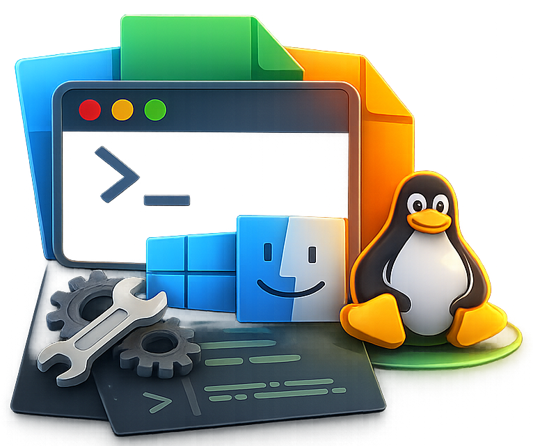

<h1 align="center">Dotfiles</h1>

<p align="center">
  
</p>

<p align="center">
  <!-- GitHub Badges -->
  
  

  <!-- Operating System Badges -->
  
  
  

  <!-- Package Manager Badges -->
  
  
  
  
</p>

---

## Package Management

Monorepo declarative package mapping:

- **Linux (Ubuntu)**:
  - [`apt-bundle`](https://github.com/apt-bundle/apt-bundle)
  - [`homebrew`](https://brew.sh/)
  - [`snap`](https://snapcraft.io/docs/)
- **macOS**:
  - [`homebrew`](https://brew.sh/)
- **Windows**:
  - [`winget`](https://learn.microsoft.com/en-gb/windows/package-manager/)

---

## Dotfiles Management

Apply dotfiles via [`mise`](https://mise.jdx.dev/):

```bash
# Enable experimental feature for dotfiles
mise settings experimental=true

# Trust the mise config
mise trust --yes mise.toml

# Apply
mise dotfiles apply --yes --force
```

Uninstall dotfiles via custom uninstaller:

```bash
# Install uninstaller
brew install veerendra2/tap/mise-dotfiles-uninstall

# Uninstall symlinks
mise-dotfiles-uninstall -c mise.toml
```

See
[`veerendra2/mise-dotfiles-uninstall`](https://github.com/veerendra2/mise-dotfiles-uninstall)
for binaries and details.

---

## Installation

### macOS & Linux

```bash
curl -fsSL https://raw.githubusercontent.com/veerendra2/dotfiles/master/bootstrap | bash
```

### Windows

```powershell
irm https://raw.githubusercontent.com/veerendra2/dotfiles/refactor-to-make-monorepo/windows/install.ps1 | iex
```

---

## Custom Cheat Sheets via `navi`

Terminal cheatsheet integration:

- Press `Ctrl+g` to launch navi as
  [shell widget](https://github.com/denisidoro/navi/blob/master/docs/widgets/README.md)
- Custom sheets are at `tools/navi/cheats/` and are automatically symlinked to
  `~/.config/navi/cheats`.

Manage cheatsheet repositories:

```bash
navi repo
```

## Tip for Machine Specific Dotfiles

### Env

`shell/common/.extra`

```
# To put local homebrew path first!
export LOCAL_HOMEBREW=1

# Override claude code settings
export ANTHROPIC_BASE_URL="https://your-gateway/v1"
export ANTHROPIC_API_KEY="YOUR_API_KEY"
export ANTHROPIC_MODEL="claude-sonnet-4.6"
export CLAUDE_CODE_ENABLE_GATEWAY_MODEL_DISCOVERY=1
```

### Ghostty Config

> - See
>   [Splitting into Multiple Files](https://ghostty.org/docs/config#splitting-into-multiple-files)
> - [Config Generator](https://ghostty.zerebos.com/)

`tools/ghostty/local`

```
# To launch custom command or shell by ghostty on start
# In this case, useful for force launch bash
command = ~/.local/Homebrew/bin/bash -l
```

### Git Config

`.extra-gitconfig`

## Test Locally

```bash
docker build --no-cache --tag dotfiles:latest .
...

docker run -it --rm -v ./:/home/dotfiles/dotfiles dotfiles:latest
dotfiles@135ec4adbe1c:~$ ./dotfiles/bootstrap
[sudo] password for dotfiles:
...
```
